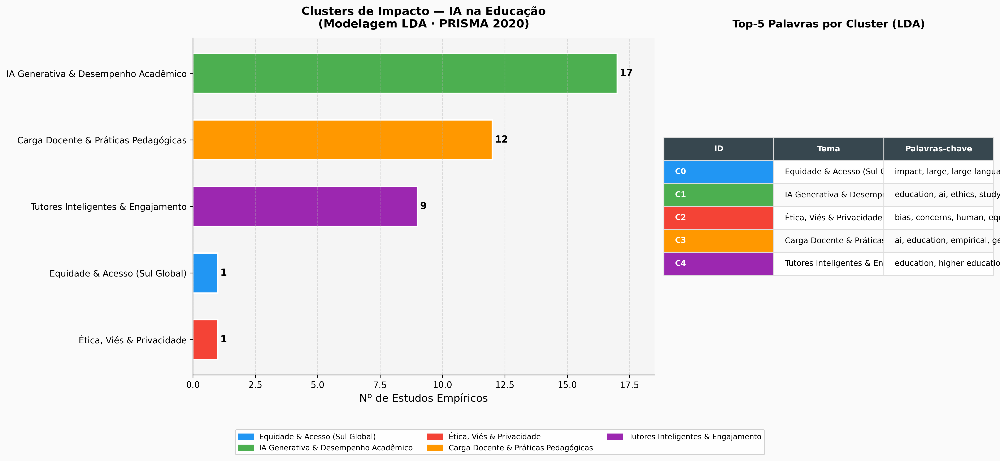

# Results Consolidation: AI in Education Research

> Generated automatically on 2026-04-21 01:26:45

---

## 1. Global Analysis Summary

# Relatório de Análise — Meta-Analysis Matrix + Scraped Data

> Gerado automaticamente em 2026-04-21 01:23  
> Arquivos fonte: `data/processed/meta_analysis_matrix.csv`, `data/processed/scraped_papers.csv`  
> Total de artigos: **53**

---

## 1. Direção dos Achados (`main_finding_direction`)

| Direção | Contagem | % |
| --- | --- | --- |
| nan | 40 | 75.5% |
| Negative | 7 | 13.2% |
| Mixed / Neutral | 5 | 9.4% |
| Positive | 1 | 1.9% |
| **Total** | 53 | 100% |

## 2. Nível Educacional (`education_level`)

| Nível Educacional | Contagem | % |
| --- | --- | --- |
| nan | 40 | 75.5% |
| Not Specified | 9 | 17.0% |
| Higher Ed | 2 | 3.8% |
| K-12 | 2 | 3.8% |
| **Total** | 53 | 100% |

## 3. Metodologia × Iniquidade (`methodology_type × inequity`)

| Metodologia \ Iniquidade | N/A | Sim | Total |
| --- | --- | --- | --- |
| Mixed Methods | 1 | 0 | 1 |
| Not Specified | 3 | 3 | 6 |
| Qualitative | 0 | 2 | 2 |
| Quantitative | 2 | 2 | 4 |
| nan | 40 | 0 | 40 |
| **Total** | 46 | 7 | 53 |

---

*Relatório gerado por `scripts/generate_summary.py`*

---

## 2. Visual Results (Figures)

Below are the visual representations of the research findings.

### Fig1 Empirical Findings

### Fig2 Prisma Flow

### Fig3 Dialectical Axes

### Impact Clusters

---

## 3. Brazilian Context Analysis

# Análise Crítica da Pesquisa Brasileira sobre IA na Educação

> Gerado em 2026-04-21 01:23 por `scripts/generate_synthesis_docs.py`  
> Corpus: 30 artigos — 27 empíricos (90%) · 3 teóricos (10%)

---

## Contextualização: O Que o Brasil Está Pesquisando?

Dos **30 artigos** coletados sobre IA e Educação no Brasil,
**27 (90%) são estudos empíricos** — relatos de experiência em escolas
e universidades, pesquisas de campo com professores, estudos de caso institucionais.
Esse predomínio empírico não é acidental: reflete uma tradição brasileira de pesquisa
educacional fortemente ancorada na prática, no chão da escola, na realidade vivida.

---

## 1. O Tema Central: Escola Pública e Desigualdade

**19 de 30 artigos** (63%) abordam escola pública
e desigualdade como contexto estruturante — não como tema secundário, mas como
**condição de possibilidade** de qualquer debate sobre IA na educação brasileira.

### Por Que Isso Importa?

O Brasil possui cerca de **47 milhões de estudantes** na educação básica pública.
Desses, aproximadamente:

- **~50%** frequentam escolas sem internet adequada (CGI.br, 2023)
- **~30%** vivem em regiões com conectividade precária (Norte e Nordeste)
- **100%** estão submetidos a uma BNCC que ainda não integra IA como competência explícita

Portanto, quando a pesquisa brasileira fala em IA educacional,
ela fala **antes de mais nada de infraestrutura, equidade e cidadania digital**.

### Artigos Representativos

| Ano | Título | Venue |
| --- | --- | --- |
| 2024 | Inteligência Artificial no Ensino de Geometria Espacial | EmRede - Revista de Educação a Dist… |
| 2024 | Para pensar o objeto da didática em sala de aula | Cadernos de Educação, Tecnologia e … |
| 2025 | FORMAÇÃO CONTINUADA E TRANSFORMAÇÕES TECNOLÓGICAS: IMPLICAÇÕES PA… | Revista Foco |
| 2026 | Da inovação à crise: | Revista Desenvolvimento &amp; Civil… |
| 2025 | EDUCAÇÃO TÉCNICA PROFISSIONAL E INTELIGÊNCIA ARTIFICIAL: UMA POSS… | ARACÊ |
| 2025 | Projeto Político-Pedagógico e o direito à educação democrática: u… | Caderno Pedagógico |

---

## 2. Brasil vs. Norte Global: Dois Usos Opostos da IA

Este é o achado mais provocativo do corpus. O contraste é estrutural:

| Dimensão | Norte Global | Brasil |
| --- | --- | --- |
| **Objetivo primário da IA** | Otimização de desempenho | Compensação de exclusão |
| **Contexto predominante** | Escolas bem equipadas | Escolas sem internet básica |
| **Tipo de IA discutida** | ChatGPT, LLMs, ITS avançados | Jogos educativos, EaD básica |
| **Preocupação central** | Integridade acadêmica, viés | Acesso, evasão, desigualdade |
| **Relação com professores** | Substituição / automação | Formação e apoio ao docente |
| **Regulação** | GDPR, AI Act (UE) | LGPD jovem, fiscalização fraca |

**Interpretação:** No Norte Global, o debate gira em torno de *como* usar IA de forma
ética e eficaz, partindo do pressuposto de que o acesso já existe. No Brasil,
o debate ancora-se em *se* e *por que* usar IA, pois o acesso ainda é exceção.
A IA no Brasil é apresentada, em muitos estudos, como **promessa redentora**
de uma educação historicamente subfinanciada — o que a teoria crítica internacional
identifica como risco de "solucionismo tecnológico".

---

## 3. Formação Docente: A Variável Crítica

**15 de 30 artigos** (50%) identificam a formação
docente como o gargalo central para a adoção responsável de IA.

Os estudos convergem em três problemas:

1. **Formação inicial defasada** — currículos de licenciatura não preparam para IA
2. **Formação continuada fragmentada** — cursos avulsos sem política estruturada
3. **Ansiedade tecnológica** — professores relatam medo de substituição, não empoderamento

### Artigos Representativos

| Ano | Título | Achado Principal |
| --- | --- | --- |
| 2025 | A Inteligência Artificial no contexto da Educação de Jo… | Este artigo é o resultado do trabalho de um grupo de educado… |
| 2024 | Inteligência Artificial no Ensino de Geometria Espacial | O artigo investiga o impacto da IA no ensino de geometria es… |
| 2024 | Percepções de professores de química da Amazônia paraen… | Levando em consideração os desafios, dificuldades e anseios … |
| 2025 | FORMAÇÃO CONTINUADA E TRANSFORMAÇÕES TECNOLÓGICAS: IMPL… | Este artigo analisa as implicações das transformações tecnol… |

---

## 4. Ética, Soberania e a Lacuna Regulatória

Apenas **10 artigos** (33%) discutem ética ou soberania
digital explicitamente — o que é **alarmante** dado o contexto:

- Plataformas estrangeiras (Google Classroom, Microsoft Teams, Khan Academy)
  coletam dados de milhões de estudantes brasileiros sem framework de auditoria adequado
- A LGPD (Lei 13.709/2018) existe, mas sua aplicação no contexto escolar é incipiente
- Não há equivalente brasileiro ao AI Act europeu para educação

---

## 5. IA Generativa: O Debate Que Ainda Não Chegou

Apenas **2 artigos** discutem ChatGPT ou IA Generativa especificamente.
Enquanto o Norte Global já debate plágio, pensamento crítico e autoria na era do GPT-4,
**o Brasil ainda está debatendo se as escolas têm computadores suficientes**.

Isso cria uma dupla vulnerabilidade:
- Quando a IA Generativa chegar massivamente às escolas brasileiras, não haverá
  política, formação ou regulação preparadas
- Os estudantes brasileiros aprenderão a usar IA com menos letramento crítico
  do que seus pares do Norte Global

---

## Conclusão: IA como Espelho das Desigualdades Estruturais

> A pesquisa brasileira sobre IA na educação não é uma pesquisa sobre tecnologia.
> É uma pesquisa sobre o Brasil — suas desigualdades, suas promessas não cumpridas
> e sua luta permanente por uma educação pública de qualidade.

---

*Análise gerada por `scripts/generate_synthesis_docs.py` | Projeto: IA & Educação Research*

---

## 4. Evidence Table

<!-- Gerado automaticamente em 2026-04-21 01:23 por scripts/generate_tables.py -->

# Tabela de Evidências — Meta-Análise

| ID | Metodologia | Tecnologia de IA | Efeito Empírico |
| --- | --- | --- | --- |
| SAMPLE_001 | Not Specified | AI (Generic / Multiple) | Mixed / Neutral |
| D001 | Not Specified | ChatGPT / LLM (Generative AI) | Negative |
| D002 | Qualitative | ChatGPT / LLM (Generative AI) | Mixed / Neutral – Results show positive outcomes for high-income schools; inequitable access re… |
| D003 | Not Specified | Automated Assessment (AES) | Negative – Empirical evidence from 12 universities reveals systematic discrimination against no… |
| D004 | Mixed Methods | Not Specified | Positive – 23% reduction in administrative burden but in |
| D005 | Quantitative | ITS (Intelligent Tutoring) | Mixed / Neutral – Effect size d=0 |
| D006 | Not Specified | ITS (Intelligent Tutoring) | Negative |
| D007 | Not Specified | ChatGPT / LLM (Generative AI) | Mixed / Neutral – 68% of students report improved outcomes |
| D008 | Quantitative | Recommendation System | Negative – Results show significant performance gains for students with learning disabilities. |
| D009 | Quantitative | AI (Generic / Multiple) | Negative |
| D010 | Qualitative | Not Specified | Negative – Empirical findings show mixed impact on student achievement, with equity and access… |
| D011 | Quantitative | ChatGPT / LLM (Generative AI) | Negative – Results indicate reduced analytical performance when AI is overused. |
| D012 | Not Specified | Not Specified | Mixed / Neutral |

---

*End of Consolidated Report*
