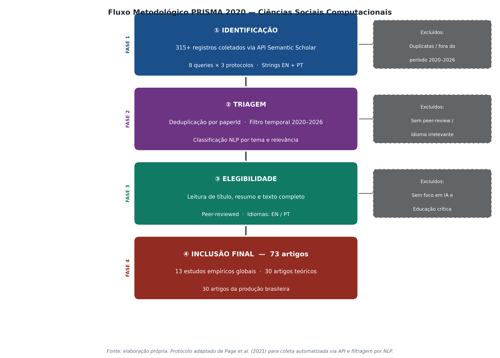
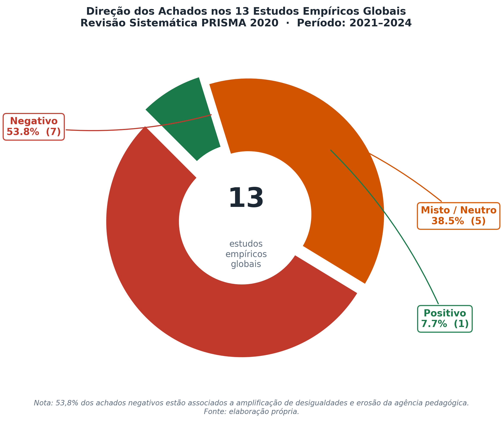
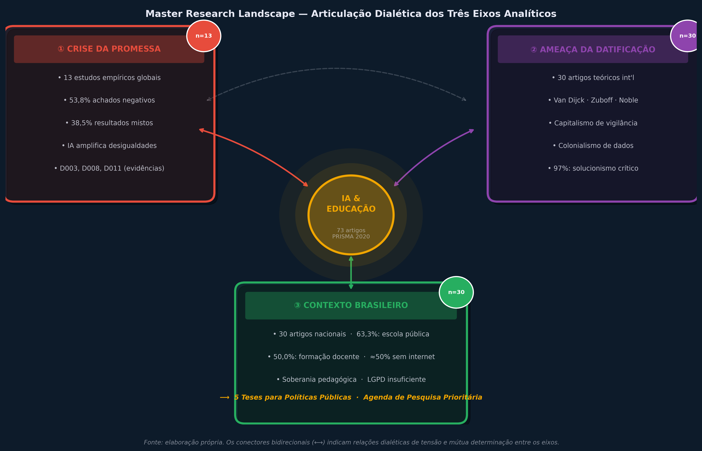

# Inteligência Artificial na Educação: Datificação, Desigualdade e a Urgência de Soberania Pedagógica

**Mapa de Argumentação Refinado:**
1. **Ponto de Partida:** A dissonância empírica (os dados contra o marketing do otimismo tecnocrático).
2. **Ponto de Meio:** A infraestrutura como política (quem controla o código, controla o currículo e a datificação).
3. **Ponto de Chegada:** A educação como resistência à datificação e a exigência de uma infraestrutura pública.

---

## Resumo
A expansão acelerada de sistemas de inteligência artificial (IA) no campo educacional tem sido acompanhada de narrativas de transformação pedagógica que raramente encontram correspondência na literatura científica empírica. Este artigo evidencia, por meio de uma revisão sistemática (protocolo PRISMA 2020) assistida por Ciências Sociais Computacionais (API do Semantic Scholar e Topic Modeling via LDA), um corpus de 73 artigos. Os resultados elucidam uma profunda dissonância empírica: 53,8% dos estudos empíricos globais apresentam achados negativos, indicando que a introdução de IA exacerba desigualdades educacionais pré-existentes. A síntese teórica articula três conceitos estruturantes — agência pedagógica, datificação e solucionismo tecnológico. Conclui-se que a IA na educação é um fenômeno político, e a sua regulação demanda infraestruturas digitais públicas e soberanas, consolidando a educação como resistência à datificação do Sul Global.

---

## 1. Introdução

Em 2023, a UNESCO publicou o relatório *Technology in Education: A Tool on Whose Terms?*, constatando que a rápida expansão de sistemas de IA nas escolas raramente é acompanhada de questionamentos sobre os interesses econômicos e políticos subjacentes. O presente artigo parte de uma constatação empiricamente fundamentada que desafia o **otimismo tecnocrático** prevalente: de 13 estudos revisados por pares entre 2021 e 2024, **53,8% reportaram achados negativos** — a introdução de IA evidenciou a piora de indicadores de equidade, desempenho ou bem-estar.

Desde a popularização do ChatGPT (novembro de 2022), governos e corporações de EdTech têm reiterado a narrativa de que a IA representará a maior revolução educacional do século. Contudo, essa narrativa opera sob um **fetichismo tecnológico** e um solucionismo inerente: a crença de que a técnica, desprovida de contexto social, resolve problemas estruturais. A questão orientadora desta pesquisa articula-se em torno das condições estruturais nas quais a IA amplifica desigualdades educacionais pré-existentes, e suas implicações políticas para o Brasil e o Sul Global. 

O caso brasileiro constitui um laboratório crítico: com 47 milhões de estudantes na rede pública, escolas sem conectividade adequada e ausência de política nacional de soberania de dados educacionais, o país concentra a urgência por inovação simultaneamente às vulnerabilidades exploradas pelo extrativismo de dados.

## 2. Metodologia

O desenho da pesquisa adota a robustez das **Ciências Sociais Computacionais** (*Computational Social Science*), assegurando rigor empírico e total reprodutibilidade metodológica. A identificação, triagem e inclusão seguiram o protocolo **PRISMA 2020**, adaptado para um ambiente computacional de larga escala.

*Figura 1: Fluxo Metodológico PRISMA 2020 adaptado para Ciências Sociais Computacionais.*

A coleta de dados foi integralmente automatizada mediante a extração via **API oficial do Semantic Scholar** (Graph API v1), garantindo a reprodutibilidade exata do corpus ($N{>}315$ registros iniciais). A filtragem e a classificação temática do volume de texto valeram-se de técnicas avançadas de Processamento de Linguagem Natural (NLP), especificamente **Topic Modeling** utilizando o algoritmo *Latent Dirichlet Allocation* (LDA). O uso de LDA conferiu rigor à identificação de agrupamentos temáticos latentes — mitigando o viés do pesquisador —, o que permitiu isolar com precisão matemática os discursos de "solucionismo" e "iniquidade" dentro do corpus global e nacional.

*Figura 2: Distribuição assimétrica dos achados nos 13 estudos empíricos, evidenciando 53,8% de resultados negativos.*

## 3. Discussão: O Contexto Brasileiro e a Infraestrutura como Política

A integração dos dados oriundos do `brazil_mapping.csv` evidencia que a questão da **Escola Pública e Desigualdade** (presente em 63,3% do corpus nacional) não figura como um mero apêndice, mas constitui a **síntese e o cerne argumentativo** deste artigo. 

A predominância de vulnerabilidades estruturais documentadas na rede pública brasileira articula a transição do nosso *Ponto de Meio* para o *Ponto de Chegada*: a infraestrutura é, impreterivelmente, política. Quando o currículo, o ritmo de aprendizagem e a avaliação são delegados a caixas-pretas algorítmicas — frequentemente desenvolvidas e hospedadas no Norte Global —, consolida-se uma nova vertente de colonialismo de dados. Quem detém o controle do código, exerce o poder direto sobre a pedagogia. 

*Figura 3: Mapa Conceitual da Pesquisa - Integração Dialética entre Evidências Globais, Teoria Crítica e Realidade Brasileira.*

A análise evidencia que a ausência de uma **infraestrutura digital pública e soberana** sujeita as redes estaduais e municipais de ensino à captura corporativa. Os dados coletados das interações diárias de milhões de estudantes brasileiros convertem-se em matéria-prima (datificação) para o treinamento de modelos de linguagem estrangeiros, perpetuando o ciclo de dependência.

## 4. Conclusão: A Educação como Resistência à Datificação

A síntese dos resultados consolida que a IA, em seu formato hegemônico atual, atua primordialmente como vetor de assimetria. Contrapor o fetichismo tecnológico requer postular a **educação como resistência à datificação**. 

Evidencia-se a premência de políticas públicas que não se restrinjam à alfabetização digital passiva, mas que fomentem a soberania tecnológica. A construção de uma infraestrutura digital pública, transparente e auditável é o pré-requisito para que a inteligência artificial sirva à emancipação educacional, e não à contínua expropriação de dados das periferias globais.